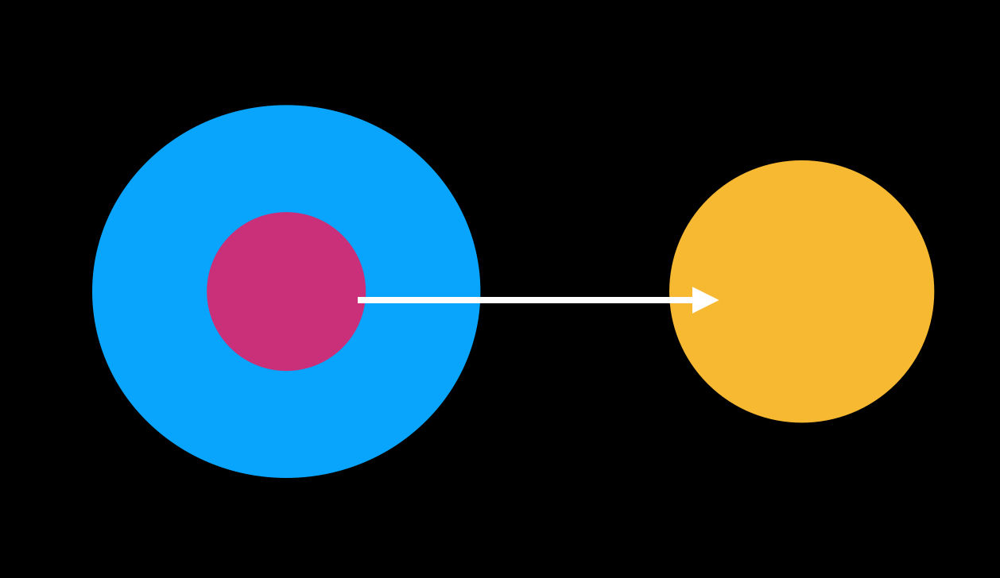
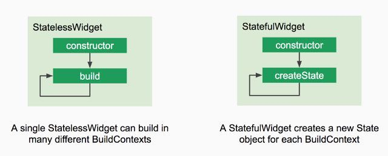
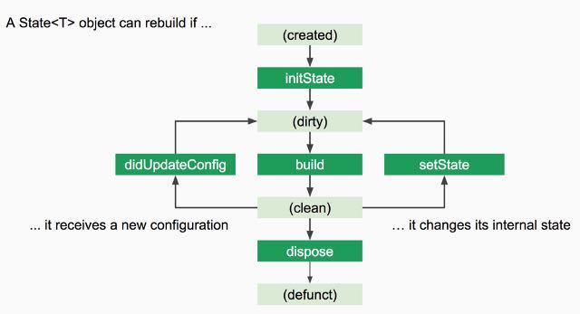

# Flutter meetup#2
> 2019.11.20 
>@Google Startup campus 
>author: huansuh 
>draft: 191120 

`// TODO` : State Lifecycle, BuildContext

## 1. State Widget

### State
`State<T extends StatefulWidget> class` 
(아래 내용은 meetup에서 들은 내용을 바탕으로 [flutter api docs](https://api.flutter.dev/flutter/widgets/State-class.html)를 읽으며 정리한 내용임. 일부 내용은 추가 확인 필요(!!))
- - -
State는 
(1) widget이 build되는 시점에 읽을 수 있고 
(2) widget의 lifetime 동안 변경될 수 있는 정보이다.

State object는 StatefulWidget이 widget tree에 들어가기 위해 생성 될 때 `createState`를 통해 생성된다.

(!!) StatefulWidget이 widget tree 상에서 여러 번 inflate 될 수 있기 때문에, 서로 다른 State object를 참조할 수 있다.
(StatefulWidget의 메모리 상에 종속된 개념은 아님)

(!!) Widget tree 상에서 제거되고 다시 추가될 때 createState를 새로 호출하므로 새로운 State 객체를 생성하게 된다.

(!!) StatefulWidget의 메모리상에 종속된 개념이 아니며, element tree 상에서 long lifespan을 가지기 때문에, 새로운 StatefulWidget instance가 이전에 만들어 둔 State object를 참조할 수도 있게 된다. [youtube link](https://youtu.be/AqCMFXEmf3w?t=288)

||
|:--:|
|*(본거 그대로 그렸다)*|

### State Lifecycle
`// TODO`

StatelessWidget에서 비어있는 state를 내부적으로 생성해서 동작하는 방식으로 구현되어있다.

## 2. Stateless & Stateful widget
### Widget
State와의 구성을 통해 화면에 표현되는 UI 요소 
(UI 상에 보여지는) Everything is Widget

### StatelessWidget
변화를 가지지 않는 상태(state)를 사용하는 widget.
 (Widget 내부적으로 mutable state를 필요로 하지 않는 widget) 
**BuildContext에 따라 Widget이 가지는 configuration 말고는 의존하지 않을 때 사용하기 좋음**
 (부모 Widget에서 해당 Widget에 대해 주어진 값에만 의존할 때) 

### Buildcontext
Widget Tree에서 Widget의 **위치**를 다루는 객체 
(Widget이 Widget Tree에 잘 위치할 수 있도록 도와주는 객체) 
`// TODO`

### StatefulWidget
변하는 상태(state)를 사용하는 Widget(mutable state를 필요로하는 widget) 
다양한 변화를 가지는 UI를 구성할 때 사용(ex: ListView, animation, ...) 
실질적인 상태와 동작은 `State`에서 
단점: Widget 간 상태 공유가 힘들다. >> State management 

**LifeCycle**
* StatelessWidget, StatefulWidget

* State

 

**상황에 맞게 알맞은 Widget을 선택해서 사용하자**
